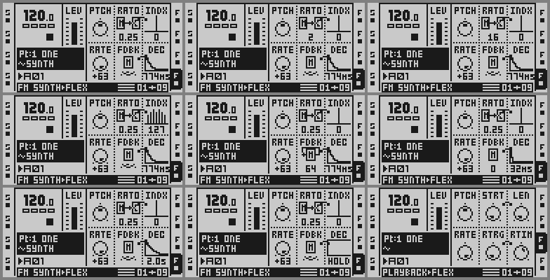

# Synth machine (phase 4: glide; phase 3: the page; phase 2: the FM voice; phase 1: the hollow voice)

Phase 4 (24 Sep 2026) adds **GLIDE** -- the pitch slews toward a new PTCH
instead of jumping, with the time set by the new PROJECT > CONTROL >
SEQUENCER > GLIDE row (`modules/quantizer`, which also gives the CHROMATIC
keys 303-style legato) -- **"Phase 4: glide"** below.
Phase 3 (22 Sep 2026) makes the PLAYBACK page present the synth -- **"Phase 3:
the page"** below. Phase 2 (22 Sep 2026) replaces phase 1's sine with a two-operator FM voice
whose parameters are the FLEX PLAYBACK page's other slots -- **"Phase 2: the
FM voice"** below has the design, the parameter map and the numbers. Phase
1's text follows it as written (its record-layout guess is corrected in the
phase-2 section and marked in place).

---

## Phase 4: glide

**With GLIDE on, a synth voice's pitch does not jump to a new PTCH word,
it slews there.** The setting is per project (PROJECT > CONTROL > SEQUENCER
> GLIDE, OFF / 1..127, saved as `#SYNTH_GLIDE=n`; `modules/quantizer/
README.md` "GLIDE and legato"), and what moves the target is anything that
changes the track's PTCH without a voice start: a trigless trig or a slide
trig with a PTCH lock, an LFO or a scene on PTCH, the PTCH knob on a
sounding note, and -- with GLIDE on -- a CHROMATIC key pressed while
another key of the track is held (the quantizer's legato hook takes the
stock trigless-trig path, so the voice is not restarted and the AMP/filter
envelopes are not retriggered). A voice START snaps to its own pitch: a
fresh note never slides in from the previous one.

**Where.** `sy_slew`, called once a frame on the second call right after
the PTCH word is read (`mvz.w (%a4),%d6; bsr sy_slew`), returns the slewed
word in d6, and everything after it -- the stock rate arithmetic
(`0x4000409e..` copied), RATE, the carrier and modulator increments -- runs
on the slewed word, so RATE and the locks keep working. The per-track state
grew from 40 to 44 bytes: `S_CUR` (+40) is the current word in Q12. At a
voice start (`sy_set`, the marker resolved) `S_CUR := PTCH << 12`. The
setting is read through ONE accessor, `sy_glide` (d2 = track → d0), from
the fixed address `GLIDE_AT = 0x400d2cdc` where the quantizer pins its
byte (`glide.s`): this cave is position independent with ratified bytes
and cannot know where the floating quantizer unit lands.

**The lag.** `cur += (target − cur) · k` per frame (T = 16/44100 s =
0.3628 ms), so τ = T/k. τ(g) = 10 ms · 100^((g−1)/126): **10 ms at 1, 31 ms
at 32, 100 ms at 64, 320 ms at 96, 1.0 s at 127** (×10 every 63 steps). k
in Q16 comes from the stock 2^x curve `PITCH_TAB` (`0x400aa294`, entry i =
2·2^((i−512)/480), Q26): with e = 127 − g, x = e · log2(100)/126 = n + f
(`3456` = the slope in Q16, n = the integer part, f the fraction),
2^f = `PITCH_TAB[32 + 480 f]` and k = 23.78 · 2^n · 2^f =
`((t >> 10) · 6087) >> (24 − n)` — 23 at 127 (τ 1.03 s), 218 at 64 (τ
109 ms), 2378 at 1 (τ 10.0 ms). The step is `(|diff| >> 8) · k >> 8`
(|diff| < 2^27, k < 2^12: no overflow; the sign handled outside), which
settles within 0.7 word = 0.03 cent of the target at the slowest setting.
GLIDE OFF: `S_CUR := target` every frame, so the rate is bit-identical to
phase 3 and turning GLIDE on mid-note starts from where the note is. Cost:
~40 instructions a frame per synth track, only with a voice on.

**Space.** `synth.s` is now 1,892 bytes (was 1,700): `sy_glide` at +0x326,
`sy_slew` +0x32e, the ratio table +0x3be, `sy_tab` +0x400 (`.balign`, the
`.org 0x360` is gone), the state +0x604 (8 × 44). `PINNED` regenerated
(linked at 0x400d7000 and 0x400d7300, identical). `REMIX=tim make cf`:
4,301 bytes changed, the direct-jump cave at 0x400d6b80 (358 B, its
index-1 form), this cave at 0x400d6d00, the page cave at 0x400d24d0
(unchanged), the quantizer at 0x400d7480 (1,484 B), its tables at
0x400d7a80/7b00/7b80, **168 B of the third run left** (was 172), the GLIDE
byte at 0x400d2cdc (the second run: 112 B left between the page cave and it).

### Measurements (24 Sep 2026, the panel on 8593, `--sound on`, T2 = SYNTH slot 5 of a copy of the OTLIVE card; the session scratchpad's `glide_audio2/3.py`, `glide_seq2.py`)

The legato and glide numbers are in `modules/quantizer/README.md` ("GLIDE
and legato", measurements 2-3): CHROMATIC [TRIG 13] held, [TRIG 16]
pressed — GLIDE 1: the pitch reaches 95 % of the way in ~40 ms; GLIDE 64:
63 % / 95 % at 126 / 326 ms (τ ≈ 100 ms); GLIDE 127: 947 / 2,387 ms (τ ≈
1 s); OFF: a step; a single key starts at its own pitch (293.6 Hz in its
first 10 ms bin); a sequenced trigless trig with a PTCH lock of +12 glides
130.8 → 523.0 Hz with the same 120 / 320 ms; the AMP envelope (ATK 64) is
not retriggered by the legato press.

### AMP slot F (XVOL) -- looked at for a later parameter, not enabled

Read from the stock disassembly for the question "could the AMP page's
slot F hold a per-track parameter?" (24 Sep 2026; nothing here is changed
by this build). The AMP descriptor is P = `0x400d3988` (E = `0x400d3950`,
page kind 2 in the resolver `0x40031da4`; kind 1 is LFO): names `ATK HOLD
REL VOL BAL XVOL` / `AMP SYNC ATCK FX1 FX2 TRIG`, defaults `0 127 127 64 64
127`, counts 128 ×6, minimums 0, enable nibbles `P+0x18e = 0x11811111` and
`P+0x18a = 0x111` — slot 5's nibble is **8** (bit 3 only: bit 0 "encoder
live" clear, bit 2 "always show" clear), formatter A[5] = `0x4003b484`
(prints `MIN` for 0, `MAX` otherwise), widget B[5] = `0x400475f8`, knob
handler `P+0x12a+20` = `0x40032ba4` (a two-state switch through the
detent accumulator `0x40032510`: turned down → 0, up → 127). So XVOL is
the crossfader volume: **a scene-only MIN/MAX switch**, which is what the
unit shows (editable while SCENE A/B is held, empty otherwise).

- **Who reads the Part byte** (`base + 0x8ee9a + track·24 + 6 + 5`; the
  4-page block is LFO +0, AMP +6, FX1 +12, FX2 +18): the frame builder's
  packer copies every flat slot 6..31 of the block into the per-track
  "current values" `0x80000810 + t·72` and the 32-slot staging halfwords
  `0x80000a50 + t·64` (`0x4000c536..60`) when its "changed" bit is set,
  so the byte does reach the DSP-bound AMP word 5 like any other AMP
  slot. **The scene morph does not read it**: the frame builder keeps a
  separate 10-entry A/B byte-pair array for XVOL at `0x800010d4` (filled
  at apply-part `0x40009486` / `0x40009c68` and pattern change
  `0x40002302`, written by the scene editor's XVOL cases `0x40053214`,
  `0x400537f2`, `0x40053e5c`, `0x40054788`) and computes `0x80000c80[t] =
  A·xf + B·(1−xf)` with **0x7f00 (127) standing in for an absent scene
  lock** (`0x4000cd22..5e` one scene, `0x4000cefc..3e` both; both scenes
  muted → all ten words forced to `0x7f00`, `0x4000cc84`); the voice code
  `0x40004ddc` / `0x40004e56` then ships that word per track in the
  mixer record (next to the mute bits). So with no scene lock the value is
  127 regardless of the Part byte.
- **A per-step lock on slot 5**: the frame builder's lock pass applies
  the lock block `0x80001558 + t·32` to all 32 flat slots (`0x4000c5e0..`),
  slot 17 included, into the staging record and `0x80000810` — the lock
  reaches the DSP's AMP word 5 by the normal path. Whether the DSP's AMP
  block reads that word is not traced (the crossfader volume it applies
  comes from `0x80000c80`, above); and placing such a lock is not possible
  from the panel: the knob handler `0x40055008` refuses a slot whose
  nibble bit 0 is clear (`0x40055044`), and so does the parameter writer
  `0x40054cd8` used by MIDI CC and the scene paths (`0x40054d20`, returns
  −1) — only the scene editor's own XVOL cases write, into the A/B array.
- **Enabling it as a 0..127 parameter** would take: nibble 8 → 5 (bits 0
  and 2; 0xd keeps the scene bit 3, whose consumer was not found by
  reference — `0x400323b8` returns the whole nibble to callers reached
  through function pointers), the knob handler `0x40032ba4` → the plain
  accumulator VOL/BAL use (`0x400328e4`), the formatter `0x4003b484` →
  VOL's `0x4003c7a0` or 0 (plain number), the name at `E+0x4e+30` (already
  `XVOL`, 4 characters + NUL), min/count/default (`E+0xa2+20` = 0,
  `E+0xd2+20` = 128, `E+0x96+5` = 127: already a full range). The lock
  editor and the packer then work as for VOL. What a CF-side consumer would
  read: the Part byte (`0x80000810 + t·72 + 17` holds the current value
  with locks applied) — the scene array is XVOL's and stays the crossfader
  volume's, so a scene lock on the slot keeps its stock meaning (MIN/MAX
  scene volume) rather than the new parameter's. The DSP's use of the AMP
  word 5 remains the open question before repurposing the slot.

---

## Phase 3: the page

**When the current track's FLEX slot holds a SYNTH\*-named sample, the
PLAYBACK page presents the FM voice** instead of a sample player. The slot
names read **PTCH RATO INDX RATE FDBK DEC** (four characters: the boxes are
19 px wide and a five-character name fills them edge to edge, measured
below); the four synth slots show their value all the time, Digitone style,
formatted as the voice understands them -- RATO the ratio table's entry
(`0.25 … 1 1.41 … 3.5 … 16`), INDX and FDBK `0..127`, DEC `HOLD` / `32ms` /
`286ms` / `2.0s`; and each draws an icon where the sample dial was: the two
operators **M→C** (RATO), a **sideband spectrum** whose bars grow with the
index (INDX), the modulator **with its feedback loop** when FDBK > 0, and the
**index envelope**, a falling curve whose length follows the value (DEC; a
flat top for HOLD). The footer reads **FM SYNTH▸FLEX**. Non-synth tracks and
every other page draw byte for byte as stock. One pinned cave (1,936 bytes,
`page.s`) and one 6-byte poke; **UNFLASHED**, everything below measured under
`ot_emu` through the virtual panel and the oracle, 22 Sep 2026; logs,
screens, takes: `out/_agents/synth3/`.



Left to right, top to bottom (T8 = SYNTH slot 5, part 1 defaults PTCH 64
STRT 0 LEN 0 RATE 127 RTRG 0 RTIM 79): the defaults (RATO 0.25, INDX 0,
FDBK 0, DEC 774ms); RATO raw 36 = `2`; raw 127 = `16`; INDX 127 (the full
spectrum); FDBK 64 (the loop); DEC 16 = `32ms` (a short curve); DEC 127 =
`2.0s`; DEC 0 = `HOLD` (flat); and T7, a FLEX track with a sample, unchanged
(`shots/remix/`, `shots/stock/`).

### Where the page comes from, and the hook

Every routine that draws or edits a parameter page finds its **descriptor**
(`docs/firmware/PARAM_PAGES.md`: `P = E + 0x38`, names at `P+0x16` six bytes
a slot, formatters `P+0xca`, widgets `P+0xfa`, enable nibbles `P+0x18e` /
`P+0x18a`) through `0x40031ee0(track, kind)` — `−1, −1` = the current track
and page kind — which tail-calls the resolver `0x40031da4`: for an audio
track and page kind 0 (PLAYBACK) it returns `0x400d5f38[machine]` at
`0x40031ece`. Callers: the generic parameter-page renderer `0x4004e0xx`
(`lea 0x40031ee0` at `0x4004e1da`; names `P+22` at `0x4004e4ea`, formatters
`P+202` at `0x4004e4f6`, the widget from `+48` past the formatter = `P+0xfa`,
the enable nibble through `0x400a6994(P+0x18a, P+0x18e, slot)`), the footer
(`0x4003d64e`: `sprintf("%s%s%s", P+9, "\x07", 0x400a78c8[machine])` =
`PLAYBACK▸FLEX`), the knob handler (`0x40054cfe`) and the p-lock/CC paths.
So **one detour** presents the whole page:

In the compact layout (CHROMATIC / SLOTS / SLICES trig modes: the page's
six boxes share the top half of the main screen with the keyboard or the
slot grid) the renderer passes the widget flags bit 1 and the stock dial
prints the value alone (0x40047a42); the widgets test that bit after the
stock call and skip the icon -- the first build blitted it anyway and
garbled the half-height boxes (23 Sep 2026).

The enable nibble of slot s (P+0x18e, nibble s from the LOW end): bit 0 =
the encoder is live, bit 1 = the renderer's small arch bridging the slot to
the one before it across the divider (stock 0x55311311 sets it on LEN and
RTIM: STRT-LEN, RTRG-RTIM), bit 2 = always show the value. The clone uses
0x55551551: always-show on RATO INDX FDBK DEC, no arches (the synth's slots
are not pairs). The first build's 0x55715751 had RATE's always-show bit
instead of FDBK's and kept the arches; both fixed 23 Sep 2026.

| site | stock bytes (displaced) | written | stub |
|---|---|---|---|
| `0x40031ece` in the resolver `0x40031da4` | `2030 0c00 6002` — `movel %a0@(0,%d0:l:4),%d0; bras 0x40031ed6` | `4ef9 400d 24d0` — `jmp pg_resolve` | replays the load; if it produced the FLEX descriptor `0x400d31ae` and the track's assigned FLEX slot is a SYNTH, `d0 := pg_desc`; `jmp 0x40031ed6` (the resolver's epilogue restores d2–d5; d1/a0/a1 are C scratch, d6/d7/a2–a6 untouched) |

The marker test is phase 1's, on the **Part's assignment** rather than the
playing voice: slot = `blob + part·6322 + 0x8f04a + track·5 + 1` (0-based;
`0xff` none, `≥ 128` the recorder buffers → no), its settings record
`0x100b14f0 + 0x448·slot`, the path at `+0` scanned (≤ 255 bytes) for the
basename after the last `/`, compared with `SYNTH`; an empty slot has an
empty path. **Nothing else is tested** — in particular not the byte at
`+0x129`, which the first build of this phase gated on as a "loaded" flag
(the phase-1 text's reading of the trig routine) and which is in fact the
sample's **QUANTIZED TRIG attribute** (`−1` = OFF … 16 = 256; the editor
`0x4006ed9e..edb2` steps it and clamps to −1..16, the trig routine
`0x40005102` posts `0x400d8120[value]` for a quantized manual trig and
trigs at once for −1). A sample loaded through the file browser has it OFF
(0xff), a project-file slot carries whatever the project saved (the
fixture's SYNTH slot: 0 = PLEN, which is why every phase-3 run passed), so
the owner's browser-loaded SYNTH.wav drew the stock page while the voice
played: **the page follows the assignment now, loaded into flex RAM or
not, as the stock page shows the sample's name** (measured below, §6). A
sample lock on a step changes the voice, not the page.

**`pg_desc` is the stock FLEX record, `P..P+0x192`, with twelve spans
changed** (`gen_page.py` generates it from the image and asserts the rest
is byte-identical): the full name `P+9` = `FM SYNTH` (the footer), the
names of slots 1/2/4/5, the four A formatters, the four B widgets, and the
enable nibbles `0x55311311 → 0x55715751` — slots 1/4 `1 → 5`, 2/5 `3 → 7`:
**bit 2 of the nibble makes the renderer pass `flags = 8`**, the "value
always shown" layout (LOOP on the SETUP page uses it), and bit 1 (LEN's and
RTIM's marker glyph left of the box) is kept. Ranges, defaults, minimums
and the six knob handlers (`P+0x12a..`) are the stock's, so storage, locks,
scenes, LFOs, the crossfader and MIDI CC behave exactly as in phase 2 — the
clone only changes what is printed and drawn. The SETUP screen (double-tap
PLAYBACK; `0x4003c8ca`), the p-lock editor (`0x400585ea`) and the LFO
destination names (`0x4003bff2`) index `0x400d5f38` inline and stay stock.

### How a box is drawn (the renderer, read from `0x4004e4c6..`)

The LCD's y axis points **up** (`screen row = 63 − y`; the pixel routine
`0x40011830` maps y to bit `31 − (y & 31)` of long `y >> 5` of a
column-major framebuffer). A box's origin is `x = 60 / 80 / 100`, `y = 36`
(top row) or `8` (bottom); the name is centred on `x+9` at `y+20` through
`0x40013904(ctx, win, x, y, 1, 0, "XXXX", "%s", name)` (a four-character
erase field); then `widget(x, y, slot, value, flags, fmt, window)` with the
descriptor's B entry, or the stock dial `0x400479b4` when it is 0. With
`flags` bit 3 the stock dial clears the box, blits its **circle bitmap
`0x400bd15a`** (11×13, the bipolar tick in row 12) at `(x+4, y+7)`, the
**pointer `0x400bdb6e[value]`** (7×7) at `(x+6, y+9)`, and prints
`fmt(buf, value)` centred at `y+1`; a locked parameter (bit 0) then inverts
`x+1..x+17, y+1..y+18`. The blit `0x400128a8(bitmap, window, x, y)` takes a
record `{width, height, longs per column, columns*, mask*}` — **one long
per column, bit 31 the bottom row, bit 31−k row k above it** — and does
`dst = (dst & ~mask) | (data & mask)`, so a full mask replaces the area.
(Calibrated against phase 2's screen: the circle's offset-0 pixel of column
0 sits at (64, 23) and its offset-12 tick at (69, 11) for box 1 at rest,
i.e. the dial at `(x+4, y+4)`; while a value is shown it moves to `y+7`
with the text below — exactly the STRT-36 frame.)

**Each widget here calls the stock dial first** — the box clear, the value
text, the lock highlight and the marker glyphs stay stock's — then composes
a **17×13 icon** in a RAM scratch (`pg_data`, 17 longs; the main OS runs
from DRAM) and blits it over the dial at `(x+1, y+7)` with a full 13-row
mask (`0xfff80000`), inverting rows 0–11 when the parameter is locked
(`flags` bit 0; row 12 = `y+19` lies outside the stock highlight and stays
empty in every icon). The icons (`page.s`, row 12 at the top; `#` = lit;
redrawn 23 Sep 2026 -- the first set carried M and C letters, ran to the box
edges and crowded the cells; every icon now keeps two columns clear of the
dividers):

```
RATO: modulator -> carrier   FDBK: the modulator      + its loop (value > 0)
.................            .................        .................
.................            .................        ..############...
.................            .................        ..#..........#...
.................            .................        ..#..........#...
..####.....####..            .....#######.....        ..#..........#...
..#..#..#..#..#..            .....#.....#.....        ..#..........#...
..#..#...#.#..#..            .....#.....#.....        ..##.........#...
..#..#######..#..            .....#.....#.....        ..###.......##...
..#..#...#.#..#..            .....#.....#.....        ...#.............
..#..#..#..#..#..            .....#.....#.....        .................
..####.....####..            .....#######.....        .................
.................            .................        .................
.................            .................        .................
```

INDX: a baseline (row 0, columns 1-15) and seven bars at columns 2 4 6 8 10 12 14 from
row 1: the carrier (column 8) `11 − 3·v/127` tall, the ±1 sidebands
`10·v/127`, ±2 `8·(v−20)/107` for v > 20, ±3 `6·(v−56)/71` for v > 56 — a
Bessel-shaped cartoon (0: one bar; 32: carrier and ±1; 127: all seven).
DEC: the baseline, an instant rise at column 1 (rows 1–11), then
`pg_env[i]` = `11·e^(−i/5)` (11 9 7 6 5 4 3 3 2 2 1 …, the floor row 1 =
I/16) stretched over `L = 2 + 13·v/127` columns 2–15 (`i = 16·(c−1)/L`,
clipped to 16), drawn as the vertical runs between consecutive heights (an
outline);
v = 0 keeps `i = 0`, a flat top at row 11 — the index holds.

**Formatters** (`fmt(buf, value)`, C convention, `sprintf` `0x40013a08`):
`pg_fmt_plain` `"%d"` (INDX, FDBK); `pg_fmt_ratio` looks the raw value up in
a copy of `sy_ratio` (`raw >> 2`, Q8) and prints `"%d"` when the fraction
is 0, `"%d.5"` when it is .50, else `"%d.%02d"` (`0.25 0.5 0.75 1 1.01 1.25
1.41 1.5 1.75 2 2.01 … 16`); `pg_fmt_decay` prints `HOLD` for 0, else
`ms = (2000·raw² + 8064) / 16129` (τ = 2 s·(raw/127)², rounded) as the
milliseconds alone (`"%d"`) below 1000 and `"%d.%ds"` above (raw 8 → `8`,
16 → `32`, 48 → `286`, 79 → `774`, 96 → `1.1s`, 127 → `2.0s`) -- the value
field is four characters wide and the first build's `598ms` ran into the
divider. Names are drawn by the renderer
from the clone; the values are the Part's raw bytes, so locks, scenes and
LFOs print what they hold.

### Space, builds

`page.s` links to **1,948 bytes** (code `+0x000..0x3de`, strings, `pg_env`,
the ratio table, the bitmap record, the mask, the scratch, the descriptor
clone at `+0x4f8`, the four column images), **pinned at `0x400d24d0`** — the
second zero run (2,064 B; 128 B left after it) — because the clone holds
absolute pointers to the formatters and widgets; `PINNED_PAGE` in
`manifest.py` is the ratified form (linked with `m68k-elf-as -mcpu=5475`,
`ld -Ttext=0x400d24d0`, `objcopy -j .text`; `out/_agents/synth3/asm/`), the
build re-links the source there and refuses on a difference, `emit()`
returns `b""` plus the one poke. The phase-2 voice cave is untouched and
still floats. `REMIX=synth make cf`: **2,345 bytes changed** (was 1,153),
the voice at `0x400d6b80`, **2,600 B of the third run left** as before
(`build_synth_v3.log`); `REMIX=tim make cf`: **3,992 bytes changed** (was
2,810), the voice at `0x400d6e00`, the quantizer at `0x400d7500..`, **172 B
of the third run left** as before (`build_tim_v3.log`); `out/mainos_cf.bin`
ends as the `tim` build. Both keep the DSP payloads, dispatch and the FX2
chooser byte-identical to stock (the CFONLY check).

### Measurements (all `out/_agents/synth3/`; the panel on 8593/8594,
`--image mainos_synth_v2.bin` (the first build; the shipped form differs
only by the marker gate, §6) / the stock section, `--card` a fresh copy of
phase 1's `synth8q.img`; `session3.py`, `remix.log`, `stock.log`, `shots/`)

**1. The page.** Booted, [T8], [PLAYBACK]: the frames in the montage and
`shots/remix/01..16`; the Part bytes after each turn confirm the encoders
map 1:1 (`remix.log`: RATO +12 +24 +16 +75 → STRT `0c 24 34 7f`, INDX +32
+32 +63 → LEN `20 40 7f`, FDBK +1 +63 → RTRG `01 40`, DEC −63 +32 +79 −127
→ RTIM `10 30 7f 00`; `/knob/reset` restores the defaults). The value
strings read `0.25 1 2 3.5 16`, `0 32 64 127`, `0 1 64`, `774ms 32ms 286ms
2.0s HOLD` (`value_rows.txt`, the glyph rows of the four boxes per
frame); the icons change as designed (INDX 0 → one bar, 32 → three, 64
→ five, 127 → seven; FDBK 0 → the box alone, 1 and 64 → the loop; DEC 16 →
a 4-column drop, 48 → 7, 127 → the full width, 0 → flat). Names: the first
build carried `RATIO INDEX DECAY` — five characters are 19 px at the 3×5
font's 4-px pitch, exactly the box interior, so `RATIO` and `INDEX` touched
across the dotted separator (`shots/remix_v1/`, `remix_v1.log`); the
four-character forms have the stock's 2-px margins.

**2. Everything else is stock.** The same key script on the stock image
(port 8594, `shots/stock/`): `00_main`, T7's PLAYBACK page and its STRT
turn, T7's AMP / LFO / FX1 / FX2 / MIXER, T8's AMP / LFO / FX1 / FX2 /
MIXER, the FLEX slot list (double-tap [T8]: `« MACHINE:FLEX`, `5▸SYNTH.wav
0.33`) and the file browser (`LOAD FILE TO FLEX 6`) — **16 frames
byte-identical** to the remix's (`/screen.txt`); the only frames that differ
are T8's PLAYBACK page, by design. Locks: REC and [TRIG 9] held on T8
(`17_trig9_held`) drew no highlight on either image — the fixture's step 9
carries no PLAYBACK lock — so the highlight path (the stock invert plus the
icon's own inversion) is by construction, not measured.

**3. Boot A/B** (`ab/`; `tools/emu/ot_emu/oracle/drive.py --emu
out/emu/ot_emu --image <stock | mainos_tim_v3.bin>`, the `inter` battery
on the OTLIVE card; `ab/remix` is the first build, `ab/remix_v3` the
shipped one): `peeks.txt` and `stderr.txt` byte-identical; `tx.bin`
**18,297 vs 18,289 bytes** — with every LED-level pair (`0x3n <id>`)
removed the streams are identical (**16,873 bytes: every LCD block and every
LED row**), the final LCD frame and LED bitmaps are identical, and the
difference is one fewer `3d 24`, `3d 25`, `3f 24`, `3f 25` each (65 → 64,
66 → 65), the breathing pair whose phase against the battery's fixed
windows shifted because the resolver now runs a few more instructions per
lookup (the first build: 18,293 bytes, `3d 24`/`3d 25` alone; `ready`
277688.167 → .171 samples, `boot.log` 65,410 → 65,404 vectors acknowledged)
— the same effect and the same size as the quantizer's loader detours
(`modules/quantizer/README.md` §5). No text, no state peek differs.

**4. The sound is phase 2's.** PLAYBACK page, RATO +36 (ratio 2), INDX +64,
PLAY 4.2 s, STOP → `takes/remix_fm_r2_i64.wav` (`fm.py --ratio 2`, 0.15–0.95
s): **261.626 Hz (+0.0 cents)**, the lines at 262 ± k·523 Hz: 262 0, 1308
−2.2, 785 −12.4, 1831 −16.0, 2355 −21.1, 2878 −37.3 dB, worst spur off the
lines −51.3 dB (a Hann sidelobe); the sidebands sit lower than phase 2's
held-index table because DEC stayed at its default 774 ms and the index
decays through the window. The `tim` image (`tim_check.py`, `shots/tim/`,
`takes/tim_fm_r2_i64.wav`) draws the identical page (`/screen.txt` equal to
the `synth` remix's, T7 equal to stock) and measures the identical lines.

**5. Gates** (`gates.log`, `gates.sh`, `REMIX=synth`): `make bus`,
`cycle_count`, `verify_slots`, `label_fmt`, `verify_octakit`,
`verify_midiscenes` (SKIP: submodule), `verify_dram_boot`, `verify_labels`
(SKIP: no selects), `verify_menushortcut`, `verify_cfprobe`,
`verify_busscreen`, `verify_ccpage2`, `verify_hidden`, `verify_grains`,
`verify_menu`, `verify_burn` (its usual SKIP), `verify_twocore`,
`verify_onebus`, `make cf` exit 0; `verify_modenames` "no module declares
mode_views" (the Makefile's SKIP); `verify_replaces` fails only on the eight
MIDI SCENES remixes without the submodule (pre-existing).

**6. A sample loaded through the file browser** (`browser_load.py`,
`repro_v2.log` / `repro_v3.log`, `shots/repro_v2/`, `shots/repro_v3/`,
`takes/repro_*`): the fixture booted, T8's PLAYBACK page and a take on the
project-file slot 5; then double-tap [T8] → the FLEX slot list, DOWN ×2 →
slot 7, RIGHT → `LOAD FILE TO FLEX 7`, DOWN ×36 → `SYNTH.wav`, YES (load),
YES (assign: T8's slot byte `04 → 06`), NO NO, [PLAYBACK], a take. The new
record reads `../AUDIO/SYNTH.wav`, `+0x128/9 = 01 ff`, `+0x134 = 0`, state
record `00000002 00010100 …` — byte for byte what the owner's unit shows
for its browser-loaded slot — and the fixture's project-file slot reads
`+0x129 = 00`. With the first build (`repro_v2`) the pre-assigned page read
`PTCH RATO INDX` and the browser-loaded page `PTCH STRT LEN` with the
footer `PLAYBACK▸FLEX` (the owner's symptom, reproduced), while **both
takes carried the voice** (261.626 Hz, spur −54 dB: the voice-side marker
in `synth.s` never looked at `+0x129`). With the fix (`repro_v3`) both
pages read the synth and both takes carry the voice (§6 numbers in
`repro_v3.log`).

### What does not work, and what is left

- **Four-character names**: `RATO`, `INDX`, `DEC` (Elektron's own for
  decay), `FDBK`; `RATIO`/`INDEX` fill the box edge to edge (measured).
- **The value text `774ms` / `286ms` is five characters** and, like a
  five-character name, spans the box interior exactly; it is legible but
  touches the separators.
- **The machine letter stays F** and the sample-name box says what the file
  is called (`~SYNTH`): the presentation lives in the footer (`FM
  SYNTH▸FLEX`, the clone's own name field, no hook) and the boxes.
- **The LFO page's PMTR destination names** still print `STRT LEN RTRG
  RTIM` (`0x4003bff2` indexes the table inline), and the SETUP page (page 2)
  is the stock LOOP/SLIC/… page.
- **The lock highlight with an icon** is unmeasured (no lock in the
  fixture); the icon inverts rows 0–11 to match the stock's rectangle.
- **Correction to phase 1's table** ("refuses an unloaded slot (`+0x129 ==
  −1`)"): that byte is QUANTIZED TRIG, and the branch trigs at once; a
  sample's presence in flex RAM is not tested there. Phase 1's text below
  is kept as written.
- The boot A/B differs by the phase of one breathing LED pair (above).
- The marker test runs on every descriptor resolve of a FLEX track (a path
  scan, ≤ 255 bytes) — UI-thread only.
- **Emulation only**; not flashed.

Tooling for the record (`out/_agents/synth3/`): `gen_page.py` (the clone
and the column bitmaps from ASCII art), `dis.py` (listing slices by
address), `montage.py`, `session3.py`, `slotlist_check.py`, `tim_check.py`,
`gates.sh`; the disassembly slices read for this phase are `dis_*.txt`.

---

## Phase 2: the FM voice

**A FLEX track whose sample is named `SYNTH*` plays a two-operator FM
voice**: `out = sin(φc + I·sin(φm + fb·m_prev))`, the carrier at the
track's pitch, the modulator at RATIO × that pitch, the index I falling
from INDEX toward INDEX/16 at the DECAY rate from every trig, FEEDBACK the
modulator's own previous sample folded into its phase. The four parameters
are the PLAYBACK page's remaining slots (phase 3 draws them as RATO / INDX /
FDBK / DEC, with icons -- "Phase 3: the page" below):

| slot (encoder) | meaning | DSP param record halfword `fp[i]` (`raw << 8`) | map |
|---|---|---|---|
| PTCH (A) | pitch | `fp[0]` = `+0` | the stock rate arithmetic, verbatim (below) |
| STRT (B) | **RATIO** | `fp[1]` = `+2` | `sy_ratio[raw >> 2]`, 32 steps, Q8: 0.25 0.5 0.75 **1** 1.01 1.25 1.41 1.5 1.75 **2** 2.01 2.5 3 **3.5** 4 4.01 4.5 5 5.5 6 6.5 7 7.5 8 9 10 11 12 13 14 15 16 (raw 0–3 = 0.25, 4–7 = 0.5, … 12–15 = 1, 36–39 = 2, 52–55 = 3.5, 124–127 = 16; the .01 steps beat at 0.0117·f0 ≈ 3 Hz at C4) |
| LEN (C) | **INDEX** | `fp[2]` = `+4` | I = 8 rad · raw/127, linear (the word's low byte counts: LFO and scene fractions morph smoothly); INDEX 0 = a clean sine |
| RATE (D) | playback rate | `fp[3]` = `+6` | the stock rate arithmetic (RATE scales the pitch increment; 127 = ×1) |
| RTRG (E) | **FEEDBACK** | `fp[4]` = `+8` | 0 .. 0.25 cycle of modulator phase per full-scale modulator sample, linear in raw; the stock retrig it used to be is switched off for synth voices |
| RTIM (F) | **DECAY** | `fp[5]` = `+10` | the index envelope: E := 1 at the trig, then `E -= (E − 1/16)·k` per frame, k = 3,068,384 / raw² (Q20; ≥ 1 = instant), i.e. an exponential toward I/16 with time constant τ = 2 s · (raw/127)²: raw 8 = 8 ms, 16 = 32 ms, 32 = 127 ms, 48 = 286 ms, 64 = 0.5 s, 96 = 1.14 s, 127 = 2.0 s; **0 = no decay** (the index holds) |

Locks, scenes and LFOs on those slots reach the voice every frame because
the cave reads the per-frame record the frame builder already fills for
the DSP (the packer's per-track pointer `0x800062a8`; the record for track
t of ping p is `0x80000510 + 384·p + 48·t`). The layout was measured by
poking the Part bytes `0x40171062..67` (T8: PTCH STRT LEN RATE RTRG RTIM)
to `64 11 22 100 33 44` and reading both ping records: `4000 0b00 1600
6400 2100 2c00` (`runs/rec_poked.log`; defaults `4000 0000 0000 7f00 0000
4f00`). **This corrects phase 1's guess**: the stock renderer's `fp@(0)` is
PTCH (0x4000 = 0 semitones), `fp@(6)` is RATE (0x7f00 = ×1, applied when
the mode byte `fp@(27)` is 0), and `fp@(10)` — which phase 1 read as PTCH —
is RTIM, feeding the retrig-interval table `0x400aae0c` into `state+24`.

### The design, and why

**Generated at the final pitch, 16 samples a frame, rate 1.0** — not at
C4 with the DSP resampling as phase 1 did. On the frame's second call the
cave writes PTCH := 0x4000 and RATE := 0x7f00 into the record, calls the
stock renderer (which therefore computes rate 1.0, ships 16 source samples
and keeps every other part of the voice lifecycle — positions, streaming,
the header, the end of the file — exactly stock), restores the two words
for the DSP, and recomputes the true rate itself with the stock renderer's
own arithmetic (`0x4000409e..0x40004104`: the PTCH word through the
`0x400aa294` 2^(x/12) curve with its 5-bit EMAC interpolation, halved for
the lower half, then the RATE word's Q31 scaling), and the carrier
increment = `C4_INC × rate` (one `mac.l` in the EMAC's fractional mode,
`<< 5`). Why: (a) the DSP's resampler becomes an identity, so there are no
interpolation images at PTCH −12 and no decimation aliasing of the FM
sidebands at PTCH +12 — the worst non-harmonic spur is −92/−93 dB at ±12
(below); (b) the cost is constant — phase 1's +12 doubled the source
samples and the cost, now +12 costs 748 instructions against 759 at 0;
(c) the DSP still applies RATE-mode, timestretch, the AMP envelope and the
effects to the record it receives as before. Retrigs: at a voice start
(bit 4 of the event byte, seen on the second call) the modulator phase,
its feedback memory and the index envelope restart and an output gain
ramps 0 → 1 in 8 frames (2.9 ms, `S_GAIN`, Q15, one `muls.l` per sample);
the carrier phase runs on (phase continuity is free). The packer latches
the RTRG count into the render state (`0x800062a4+4 := fp[4]`) between the
two calls of a start frame; a synth voice clears it on the second call, so
the stock sub-segment retrigs never fire and RTRG is FEEDBACK.

**The engine** (ColdFire assembly, `synth.s`, GNU as `-mcpu=5475`; a
`m68k-elf-gcc` 16.2.0 *is* installed at `/opt/homebrew/bin`, but the
module stays assembly like its siblings — the build's `CavePatch` pipeline
assembles and links `.s`): fixed point throughout; the two sine lookups use
the phase-1 256+1-entry s16 table with linear interpolation (`mvs.w` ×2,
`muls.l`, two `asr.l #8`), the phase offset is `m_Q14 × I` with `muls.l`
(the 32-bit product wraps, which is what a phase wants), feedback `m_prev ×
fb` the same way, the output `(c × gain) << 1` whose high word is the
sample (`clr.w`, two `move.l` for L and R). 39 instructions per sample.
The EMAC is used only in the per-frame rate arithmetic, in the same
fractional mode and instruction forms as the stock renderer (`msac.l
%d1,%d2,(%a0)+,%d2,%acc0` / `mac.l` / `movclr.l`; the encodings match the
stock bytes). Level: the carrier is ±0x4000 (−6 dBFS source) and the gain
is ≤ 1.0, so the sample never exceeds it — nothing to saturate; measured
−24.0 dBFS at the fixture's track/main levels, as phase 1.

**Space.** The cave is **1,684 bytes** (code 0x000–0x30d, `sy_ratio`
0x30e, `sy_tab` 0x350, per-track state 8 × 40 B at 0x554), position
independent — linked at `0x400d6b80`, `0x400d6e00`, `0x400d7000` and
`0x400d7300` the bytes are identical (`out/_agents/synth2/asm/`) — and
pinned as phase 1 (`PINNED`, `reference=lambda addr: PINNED`, `emit()`
returning `b""` plus the kind-table poke). `REMIX=synth make cf`: **1,153
bytes changed**, cave at `0x400d6b80`, **2,600 B of cave left**
(`build_synth.log`). `REMIX=tim make cf` (DIRECT JUMP + SCALE QUANTIZER +
SYNTH): **2,810 bytes changed**, the synth cave at `0x400d6e00`, the
quantizer unit moved to `0x400d7500` and its tables to `0x400d7a80..`,
**172 B of cave left** (`build_tim.log`) — the next module in `tim` wants
the second zero run (`0x400d24d0`, 2,064 B) or a DRAM unit. Both DSP
payloads, dispatch and the FX2 chooser byte-identical to stock (the CFONLY
check).

### Measurements (all `out/_agents/synth2/`; lockstep `--dsp` unless said)

Rig: `rig.py` (render.py with timed pokes and pc watches), `fm.py` (FFT
of a window: the fundamental with parabolic interpolation, the FM lines
f0 ± k·ratio·f0 relative to the strongest line, the worst spur off those
lines, the strongest peaks; `--decay` the sideband/fundamental energy per
25 ms bin), `cost2.py` (phase 1's cost.py with the addresses as
arguments), `panel_session.py` (the panel on 8593). Card: phase 1's
`synth8q.img` (T8 = SYNTH slot 5, LOOP on, trigs on steps 1 and 9, 120
BPM: notes at 0.0 and 1.0 s, 1 s each). Parameters are poked into T8's
Part bytes before PLAY (`0x40171063` STRT, `..64` LEN, `..66` RTRG,
`..67` RTIM, `..62` PTCH); windows are 0.15–0.95 s (the first note, past
the voice-start burst described under "What does not work").

**1. INDEX 0 = a clean carrier** (`runs/base`, defaults: STRT 0, LEN 0,
RTIM 79): **261.626 Hz (+0.0 cents)** by FFT, 261.636 Hz by zero
crossings, −24.0 dBFS L/R. Spur: −54.0 dB with the Hann window (that is
the window's own sidelobe at ±7 Hz, as phase 1's −51/−52 were); with a
4-term Blackman-Harris window the **worst non-harmonic spur is −96 dB**
and the harmonics h2–h5 are −104 to −119 dB. The second note (1.15–1.95 s)
reads the same pitch, spur −77 dB. Under the panel's rt JIT mode (take
12, defaults) 261.626 Hz, spur −54 (Hann).

**2. Sidebands** (`runs/r{1,2,35}i{32,64,127}`, RTIM 0 so the index
holds; STRT raw 12 / 36 / 52 = ratio 1 / 2 / 3.5, LEN raw 32 / 64 / 127 =
2.0 / 4.0 / 8.0 rad). Every line sits at f0 ± k·ratio·f0 to the Hz, the
fundamental stays at 261.62 Hz (±0.1 cents) in all nine, and the
strongest peaks (dB relative to the strongest line) are:

| ratio | INDEX 32 (2 rad) | INDEX 64 (4 rad) | INDEX 127 (8 rad) |
|---|---|---|---|
| 1 (fm = 262 Hz) | 523 0, 785 −6.9, 262 −14.0, 1046 −14.2, 1308 −26.4, 1570 −39.6 | 262 0, 1046 −2.4, 523 −6.5, 1308 −10.0, 1570 −13.9, 785 −20.5, 1831 −24.1, 2093 −32.9 | 1570 0, 2093 −1.0, 1308 −1.1, 262 −5.0, 2355 −9.8, 2616 −10.4, 1831 −12.8, 1046 −13.6, 523 −18.9 |
| 2 (fm = 523 Hz) | 262 0, 1308 −4.1, 785 −11.1, 1831 −18.2, 2355 −25.4, 2878 −42.4 | 1308 0, 262 −4.5, 785 −5.2, 2355 −5.5, 1831 −14.7, 2878 −19.5, 3401 −21.5 | 3401 0, 1308 −4.2, 262 −4.2, 4448 −5.5, 785 −5.5, 1831 −10.9, 2878 −12.8, 3924 −16.6, 5494 −17.7 |
| 3.5 (fm = 916 Hz) | 654 0, 1177 0, 2093 −4.2, 1570 −4.3, 262 −8.6, 2485 −12.8, 3009 −12.9, 3924/3401 −24.4 | 2485 0, 3009 0, 262 −0.8, 2093/1570 −1.7, 3924/3401 −3.6, 4317/4840 −10.1, 5232/5756 −18.6 | 5756 0, 5233 0, 6148 −0.5, 6671 −0.6, 2485 −1.2, 3009 −1.3, 654/1177 −3.1, 7064/7587 −3.6 |

(the Bessel pattern: at 2 rad the first sideband leads, at 4 rad the
fundamental's J0 is small, at 8 rad the energy sits at k = 5–7). Off the
lines the worst spur is −54 dB (a window sidelobe) at INDEX 32; the
"spurs" at higher index (−33 to −1 dB) are the k = 7.. lines beyond fm.py's
six. WAVs to hear: `wav/fm_ratio1_index64.wav`,
`wav/fm_ratio2_index64.wav`, `wav/fm_ratio3.5_index64.wav`, plus
`fm_ratio2_index127.wav`, `carrier_index0.wav`.

**3. DECAY** (`runs/dec16`, `runs/dec48`: ratio 2, INDEX 64, RTIM 16 = τ
32 ms and RTIM 48 = τ 286 ms). Sideband/fundamental energy per 25 ms bin
from the trig (dB; the first bin holds the voice-start burst):

- RTIM 16: `+13.2 −5.6 −8.1 −9.1 −9.6 −9.9 −10.0 −10.0 −10.1 …` — **−10 dB
  by 150 ms**, then flat at the floor (I/16 = 0.25 rad reads −10.1 dB on
  this metric).
- RTIM 48: `+8.1 +11.0 +17.5 +25.6 +11.7 +6.1 +2.6 +0.1 −1.8 −3.2 −4.2
  −5.0 −5.6 −6.0 −6.4 −6.7 −7.0 … −7.8 (0.5 s) … −8.9 (0.7 s) … −9.6
  (0.975 s)` — the peak at 75–100 ms is the fundamental's J0 null as the
  index passes 2.4 rad, and fitting the small-index tail (0.2–0.5 s, where
  the ratio ≈ I²/2: I = 1.15 → 0.58 rad) gives **τ = 0.295 s** against the
  designed 0.286 s; −10 dB relative to the 100 ms value at ~170 ms.
  `wav/fm_ratio2_index64_decay48.wav`.

**4. A lock on one step; a scene on the crossfader** (the panel on 8593,
`--image mainos_synth.bin --card cards/panel.img --sound on`, rt 1.002;
`session.log`, `shots/`, `takes/`). [T8], PLAYBACK page, STRT +36 (Part
`40 24 00 7f 00 4f`: ratio 2), grid recording, [TRIG 9] held, LEN +64 →
**the lock byte `0x400e62f1` = 0x40** (T8's track record `0x400e6196` +
0x59 + 8·32 + 2; PTCH/STRT stay `ff`) and the Part's LEN untouched (a
later turn without the trig set the Part's LEN to 127). Then [SCENE B]
held, STRT +64 → scene B's RATIO = raw 100 (10.0), the Part's STRT still
36. Takes with `/xfader?pos=`:

| pos | step 1 (Part: INDEX 127) | step 9 (lock: INDEX 64) |
|---|---|---|
| 0 (scene A, ratio 2) | lines at 262 ± k·523: 1308 0, 1831 −2.8, 262 −2.8, 2355 −3.0, 785 −3.2, 2878 −10.8, 3401 −15.6 — the 8-rad pattern | 785 0, 262 −6.7, 1308 −11.6, 1831 −12.9, 2355 −27.6, 2878 −36.0 — the 4-rad pattern: **the lock changed step 9 only** |
| 64 (the morph: raw 68 → ratio 5) | lines at 262 ± k·1308: 3663/4186 0, 4971/5494 −2.2, 262 −2.2, 2355/2878 −3.3, 6279 −7.2 | 1046/1570 0, 2355/2878 −3.2, 262 −10.5, 3663/4186 −10.8 |
| 127 (scene B, ratio 10) | lines at 262 ± k·2616: 7587/8110 0, 262 −2.2, 10203/10727 −2.3, 4971/5494 −3.3, 13343 −7.3 | 2355/2878 0, 4971/5494 −3.2, 262 −10.5, 7587/8110 −10.8 |

The crossfader morphs the raw STRT value, so RATIO steps through the
table (2 → 5 → 10 here); INDEX under a scene would morph smoothly. WAVs:
`wav/panel_sceneA_ratio2_step1idx127_step9lock64.wav`,
`wav/panel_xfader64_ratio5.wav`, `wav/panel_sceneB_ratio10.wav`.

**5. PTCH ±12** (`runs/p12`, `runs/m12`: Part PTCH 124 / 4, ratio 2, INDEX
64): **523.250 Hz (−0.0 cents)** and **130.813 Hz (+0.0 cents)**; the
lines at 523 ± k·1046 and 131 ± k·262 with the same relative levels as at
PTCH 0 (−4.4/−5.2/0/−14.7/−5.5/−19.4/−21.6 dB for k = −1..6, i.e. the
timbre is pitch-invariant); **worst non-harmonic spur −92.3 dB at +12,
−93.0 dB at −12** (Blackman-Harris) — no aliasing to band-limit. The
first-order k = 7.. lines above the six fm.py lists reach 7,849 Hz at −37
dB at +12, which is the FM spectrum itself, not aliasing.

**6. Mute, AMP, FX1** (`runs/amp`, `runs/fx1`, `takes/mute2.wav`). AMP
ATK 60 / HOLD 30 / REL 40 poked (`0x40171128..2a`): the 100 ms envelope
of each note reads `−31 −34 −29 −26 −24 −31 −94 −90 …`, rising and released
as phase 1's sine did. FX1 FILTER BASE 100 (`0x4017112e`): −38.9 dBFS
against −23.1 (the FM tone keeps energy above the high-pass, so less than
phase 1's −69.7 for a bare 261 Hz). FUNC + [T8] at 2.0 s of a panel take
(mute mask `0x8000000a` → 0x80): `… −23 −24 −25 −30 −90 −90 −90 −90 −90 −90
−18 −20 −36 −85 −104 −90 …` — digital silence after the mute, except the
DSP's voice-start burst at the 3.0 s trig (below), which the mute does not
stop either. `wav/panel_mute_at_2s.wav`.

**7. Cost** (`runs/base/hits.txt`, `runs/p12/hits.txt`; `cost2.py hits
400d6b80 400d6e86` — the cave's entry and its `rts` at +0x306 — plus the
stock pair `0x40004008/0x40004266`; T8 = SYNTH, the frame's event nibble
is 4 on this card so the calls are [0,4) and [4,16)):

| per frame, T8 = SYNTH | first call [0,4) | second call [4,16) | (a [0,16) frame) |
|---|---|---|---|
| PTCH 0: cave's own | 203 | **603 mean, 764 max** | **759 mean, 920 max** |
| … stock renderer inside | 418 | 855 mean, 1,068 max | 936 mean, 1,152 max |
| … wrapper total | 621 | 1,458 mean, 1,684 max | 1,695 mean, 1,912 max |
| PTCH +12: cave's own | 203 | 592 mean, 753 max | **748 mean, 909 max** |
| … wrapper total | 621 | 1,447 / 1,673 | 1,684 / 1,901 |
| a FLEX track that is NOT a synth: cave's own | 28 | 34 mean (174–180 max, a start frame's name scan) | |

The cave's own work is 39 instructions a sample plus ~140 a frame, under
the 1,500 target, and the same at +12 (phase 1: 361 at 0, 681 at +12). The
stock renderer's part is what a playing FLEX track costs anyway.

**7b. The settings-record bounds check (24 Sep 2026).** A start frame's name scan follows the voice struct's `+8` pointer; it is now scanned only when it lies inside the settings table (`0x100b14f0` + 136 x `0x448`), because on the unit RAM after power-on is garbage and a refused start leaves the previous value -- the emulator's zeroed RAM never showed it. Code +14 B, the tables moved to `+0x360` / `+0x564`, cave 1,700 B.

**8. Stock behaviour untouched** (`ab/`): `tools/emu/ot_emu/oracle/drive.py
--emu out/emu/ot_emu --image <stock | mainos_synth.bin>`: `ready.txt`,
`steps.txt`, `stamps.txt`, `peeks.txt`, `txlen.txt`, **`tx.bin`** and
`stderr.txt` byte-identical; `boot.log` differs only in the image path
line. **9. Gates** (`gates.log`, `REMIX=synth`): the same battery and the
same results as phase 1 — every `verify_*` and `make bus`/`make cf` exit 0,
`verify_midiscenes`/`verify_labels`/`verify_burn` their usual SKIPs,
`verify_modenames` its "no module declares mode_views", `verify_replaces`
failing only on the eight MIDI SCENES remixes without the submodule
(pre-existing). `REMIX=tim make cf` boots and plays the voice (`runs/tim`:
261.626 Hz, the ratio-2 lines).

**FEEDBACK** (`runs/fb`, `wav/fm_ratio1_index64_feedback127.wav`: ratio
1, INDEX 64, RTRG 127): the ratio-1 lines stay (523 0, 262 −0.4, 785 −2.7,
1046 −13.4 …) and the spectrum fills up to Nyquist (a cluster at 21.3–21.9
kHz at −3 to −13 dB): full feedback on a 262 Hz modulator is a bright,
noisy, aliased saw-like modulator, as on any FM synth — usable, not
subtle; the useful range is the lower half.

### What does not work, and what is left

- **A ~30 ms burst at every voice start, up to full scale**, in the
  emulator: the stock image playing the silent `SYNTH.wav` on the same card
  produces the identical sample sequence at each trig (`runs/stock_silent`:
  `103 −310 −916 −587 957 2037 …` from sample 81, peaks 19,281 at 0.0 s and
  32,767 at 1.0 s; phase 1's image the same, `runs/len0`), it passes the
  track mute, and at 12 ms the T8 record already holds the cave's own sine
  (`runs/hdr_watch.log`) — so it is the DSP's voice-start path (or its
  emulation) working on stale data, not the cave. Phase 1 saw only its RMS
  trace ("a 1 dB dip in one 10 ms bin"; the 100 ms envelopes here read −17
  /−19 at 1.0–1.2 s). It hides the retrigger click the start ramp was for,
  so the ramp's effect could not be measured; whether hardware shows it is
  the first thing to check after a flash.
- **RATE 0 (raw 64) gives DC**, not silence: the increments are 0 and the
  last sample value holds until the AMP envelope ends the note. RATE
  reverse (raw < 64) plays forward at the stock's magnitude, as the copied
  arithmetic does for a sample's rate (direction is elsewhere). Neither is
  measured.
- **RTRG's stock retrigs are gone for synth voices** (by design: the slot
  is FEEDBACK); RTIM no longer sets a retrig interval. Timestretch modes
  and sample locks between SYNTH and a sample were not re-measured in
  phase 2.
- **RATIO is a 32-step table** (raw >> 2): a scene morph on it steps, an
  LFO on it steps; INDEX, FEEDBACK and DECAY morph continuously. The table
  starts at 0.25, so a fresh FLEX track (STRT 0) has ratio 0.25 until the
  encoder is turned.
- **The index floor is fixed at I/16** and the decay law is τ = 2 s ·
  (raw/127)²; both are constants in `synth.s` (`ENV_FLOOR`, `K_NUM`).
- ~~**Labels and icons are phase 3**: the page still reads STRT/LEN/RTRG/RTIM.~~ Done: "Phase 3: the page".
- Space in `tim` is down to 172 B; the next cave there goes to the second
  zero run or DRAM.
- **Emulation only**; not flashed.

---

# Phase 1: the hollow voice (22 Sep 2026, kept as written)

**A FLEX track whose sample is named `SYNTH*` plays a generated waveform
instead of the sample.** In this phase the waveform is a clean sine at
**C4 = 261.6256 Hz for PTCH 0** (the semitone reference; TRIG 13 in
CHROMATIC mode); everything else is the Octatrack's own FLEX machinery.
The ColdFire generates the track's *source* sample data every frame and
the DSP does what it does to any sample: PTCH with parameter locks, LFOs,
scenes, the chromatic keys and the quantizer; RATE, retrigs, sample locks;
the AMP envelope; the filter and FX1/FX2; level, pan, mute and cue. A
stock unit plays the file itself (the shipped `SYNTH.wav` is silence), so
a project that uses it degrades to a silent track, not a broken one.

One ColdFire cave (1,068 bytes, floating, position independent) and one
4-byte poke, both in the main-OS section; no displaced instructions, no
hook in a stock routine. **UNFLASHED**; everything below is measured under
`ot_emu` — the lockstep interpreter through the pipe, and the panel's
real-time JIT mode through keys and takes — 22 Sep 2026. Logs, WAVs,
screens and numbers: `out/_agents/synth/`.

To try it: build (`PATH=.venv/bin:$PATH REMIX=synth make cf` or `REMIX=tim
make cf` → `out/mainos_cf.bin`), put any WAV named `SYNTH.wav` (or
`SYNTH-anything.wav`; 16-bit 44.1 kHz, a few seconds, LOOP on for a held
note) in the set's AUDIO folder, load it into a FLEX slot with the unit's
file browser, assign the slot to a FLEX track, place trigs. `PTCH` is the
note, the AMP page the envelope.

## The design, and why

Two ways were on the table: **(A) a sixth machine type, SYNTH**, in the
SELECT MACHINE TYPE list with its own descriptor, or **(B) a FLEX machine
whose sample is a marker the cave recognises**. This is (B), for what the
disassembly says about (A):

- The Part stores machine type 0..4 and lays out the PLAYBACK parameters
  as **five 6-byte blocks per track** (`base + 0x8edaa + track·30 +
  machine·6 + slot`) and the sample slots as **five bytes per track**
  (`base + 0x8f04a + track·5 + machine`): a machine index 5 indexes the
  NEXT track's blocks. Every reader computes that itself — 40 sites read
  the machine byte (`addal #585122` in the listing), 26 read the parameter
  base, in the knob handler, the p-lock editor, the trig routine, the
  frame builder, the pages, the MIDI paths and the project code. Aliasing
  5 → 1 everywhere is a large, error-prone patch set; the descriptor
  table's spare entries (`0x400d5f4c/50` = NEIGHBOR's page, `0x400d5f54`
  = 0) are the only part of (A) that is one poke.
- The trig routine `0x40005030` starts a FLEX voice only for a *loaded*
  slot (settings byte `+0x129 ≠ −1`), so a pseudo-slot with no sample
  never sounds, and the voice-start path (`0x4000f450`, the streamer
  `0x40005c7c`, the retrig and end-of-sample logic) is exactly what a
  synth voice wants to reuse rather than replace.

So: keep the FLEX machine whole, and take over its **audio** at the one
point where it is produced. The per-frame record packer renders each
track through a per-track renderer pointer; the cave sits in front of the
FLEX renderer, lets it run, and then rewrites the source samples it just
shipped. The DSP resamples that source by the voice's rate, which is where
PTCH, the locks and the LFO are already folded in — no pitch arithmetic in
the cave at all.

## What was found (stock 1.40C main OS at `0x40000400`; listing `out/_agents/synth/mainos.dis`)

### The per-frame record and its renderers

| what | where |
|---|---|
| the record packer | `0x4000d3fc..0x4000d55e`: for each of 8 tracks, cursor `0x80001c80 := 0x80001c90 + ping·0xa80 + 336·track` (T1–T4's records go to core 1, T5–T8's to core 0 via eDMA ch 0), then TWO renderer calls, `renderer(track, ping, 0, n)` from the current table `0x400d61d0[track]` and `renderer(track, ping, n, 16)` from the next-frame table `0x400d61f0[track]`, where **n = the low nibble of the per-track event byte `0x46104d0c + track`** — the sub-frame position of this frame's event — and **bit 4 of that byte = a voice starts this frame**: the packer then calls the start handler (`0x400d6454[kind]`, `0x4000f450` for STATIC/FLEX), installs the new renderer from the kind table, resets the render state (`0x80004898 + 40·track`) and clears bits 4–7 AFTER the second call |
| the kind table | `0x400d6434`, 8 longs, index = the machine type (byte `0x80000eb4 + ping·8 + track`): 0 STATIC / 1 FLEX / 4 PICKUP → `0x40004008` (the sample renderer), 2 THRU → `0x40004424`, 3 NEIGHBOR → `0x4000466c`, 5–7 → `0x400047f0` (silent). The renderer for track t is installed at `0x4000c004` (`0x400d61f0[t] := table[kind & 7]`) |
| the sample renderer | `0x40004008(track, ping, start, end)`, C convention, d0/d1/a0/a1 scratch: writes a 16-byte header at the cursor, recomputes the rate on the frame's second call (`btst #4` on the `end` argument's low byte — 16 = the full frame), ships the source samples through `0x40007960` in sub-segments (retrigs), advances the cursor. The rate: **[corrected in phase 2: `fp@(0)` is PTCH, `fp@(6)` RATE, `fp@(10)` RTIM — the retrig interval; the text below is kept as written]** the pitch word `fp@(10)` of the DSP parameter record (`fp = 0x80000510 + ping·384 + 48·track`) interpolated through the table `0x400aae0c` (a 2^(x/12) curve) into `state+24`, times the RATE word `fp@(0)` through `0x400aa294`, into `state+36`, Q26 (`0x04000000` = 1.0) |
| the record a call writes (measured, `runs/stock_explore2.log`) | header `+0` = source count (bits 0–7) \| out count << 8 [\| out2 << 16 \| out3 << 24], `+4` fractional phase, `+8` rate Q26, `+12` tag; then `src` samples of 8 bytes: L long, R long; **the DSP takes the top 24 bits of each long** (a 16-bit sample sits at bits 31..16). Silent T8 at n = 0: `[0,0,0x04000000,0]` then `[0x1010, 0x20, 0x04000000, 0x8000]` + 16 zero pairs; a sounding track at n = 4: `[0x404, 0x3c, 1.0, 0xf0000000]` + 4 pairs, `[0xc0c, 0, 1.0, 0]` + 12 pairs (`ffbe0084 ffb000a0 …`) |
| the voice struct | `0x800049d8 + 0xa8·track`: `+0` active byte (`0xff` while the CF voice runs, 0 when it ended — after which the renderer ships zeros), `+4` the slot's state record (`0x46c922c4 + 44·slot` FLEX, `0x46c90a78 + 44·slot` STATIC), `+8` its settings record (`0x100b14f0 + 0x448·slot` FLEX, `0x100d5b30 + …` STATIC), both written by the start handler `0x4000f450` at `+0x4dc/+0x4e0` unconditionally, i.e. before the start frame's second call. **The settings record's path string is at `+0`** (`"../AUDIO/SYNTH.wav"` for a slot the unit's own browser loaded; slot numbers are 0-based: FLEX slot 5 = index 4 = `0x100b2610`) |
| the trig → voice path | `0x40005030(track, cmd, flags, slot)`: reads the machine byte, the Part's slot byte (`+0x8f04a + track·5 + type`, or the argument), the settings record (`≤ 128` STATIC, `≤ 135` FLEX/PICKUP), refuses an unloaded slot (`+0x129 == −1`), posts `0x8000186e/0x8000188e/0x800018ae[track]` (`slot \| type << 10`); the frame builder (`0x4000b2ee..`) checks the type against the Part's machine byte and posts the mailbox `0x46c80354[track]` and the slot byte `0x46c80282[track]`; `0x400068e4(track, ping, start, end)` is the per-track voice state machine the packer runs before rendering (`0x4000d322`), not a renderer |
| parameter locks (found on the way, corrects a 35-byte guess) | a pattern's track record (`blob + pattern·0x8ed8 + track·0x91a`; bank A blob `0x400e21e0`) holds **32 bytes per step from `+0x59`**: byte 0 = PTCH … byte 31 = the sample slot lock; the p-lock editor `0x40050e60` writes the blob byte and an SRAM mirror (`0x100161a6 + pattern·stride + track·2330 + 1 + step·32 + param`). T8 step 9's PTCH lock: blob `+0x159`, mirror `+0x101` |
| the FLEX cost, stock (`runs/stock_explore.log`, `hits` on `0x40004008/0x40004266`) | first call 16 instructions; second call 261 idle, 264–694 streaming, **897–1,152 for the playing SYNTH slot** (mean 936) |

### The cave (`synth.s`, 1,068 bytes; `.org` layout in `manifest.py`)

`sy_render(track, ping, start, end)` at `+0` is the kind table's FLEX
entry (`0x400d6438`: `0x40004008` → the cave, poked by `emit()` — the
build asserts the stock long first). It saves `d2–d7/a2–a3`, notes the
cursor, calls the stock renderer with a copy of its four arguments, keeps
its return value, then:

- on the frame's **second call** (`end == 16`) with **bit 4 of
  `0x46104d0c + track`** set (a voice starts this frame): resets the
  track's phase and resolves the marker from the new voice's settings
  record — the file name after the last `/`, compared with `SYNTH` (five
  characters, case-sensitive, 255-byte scan limit, a null record = no) —
  into `sy_on[track]`. The first call of that frame renders the OLD voice's
  tail with the old flag, so a step that sample-locks from a sample to
  SYNTH (or back) switches exactly at the trig's sub-frame position;
- if `sy_on[track]` and the CF voice is active (`voice+0 ≠ 0`): reads the
  source count from the header it noted (`+3`), and rewrites the L and R
  longs of every shipped source sample with `sine(phase) << 16`, phase +=
  `25,480,119` (Q32 cycles: 261.6256/44100 · 2^32, 0.000 cents off);
  the sine is a 256 + 1 entry s16 table (amplitude `0x4000` = −6 dBFS)
  with linear interpolation (predicted worst spur −64 dB; no
  interpolation would be −48).

Position independent (pc-relative data, OS absolutes): the bytes are
identical linked at `0x400d7000`, `0x400d7300` and `0x400d6b80`
(`out/_agents/synth/asm/`), and `PINNED` in the manifest is the ratified
form the build re-links at the address the cave lands on — `0x400d6b80`
in `synth`, `0x400d6e00` in `tim`, both accepted. State lives in the cave
(`sy_on[8]`, `sy_phase[8]`; the main OS runs from DRAM).

Builds: `REMIX=synth make cf` → 761 bytes changed vs stock, cave at
`0x400d6b80`, 3,216 B of the zero run left (`build_synth.log`); `REMIX=tim
make cf` (DIRECT JUMP + SCALE QUANTIZER + SYNTH MACHINE) → 2,418 bytes
changed, the synth cave at `0x400d6e00`, the quantizer's tables at
`0x400d7800..`, **812 B of cave left** (`build_tim.log`). Both keep the
DSP payloads, dispatch and FX2 chooser byte-identical to stock (the CFONLY
check).

## Measurements (all `out/_agents/synth/`)

**Rig.** `trees/synth8q` = the clean tree2 fixture (`out/_agents/audio/tree2`)
with `SYNTH.wav` (4 s of silence, 16-bit mono 44.1 kHz) as FLEX slot 5
(`LOOPMODE=1`), T8 on it in parts 1 and 5, T3/T4/T7 moved to empty slots
so only T8 sounds, the fixture's step-9 sample-slot lock on T8 cleared
(`mktree.py`, `cards/synth8q.img`); T8 trigs at steps 1 and 9, 120 BPM.
`render.py` boots `out/emu/ot_emu --interactive --dsp` (lockstep) on the
image + card, PLAYs, captures main L/R; `measure.py` gives the FFT peak
(parabolic interpolation, 0.8 s Hann window), zero-crossing frequency,
RMS and a 100 ms envelope. `explore.py` is the peek/watch driver.

**1. PTCH 0** (`runs/ptch0`, `REMIX=synth`): the first note, 0.1–0.9 s:
**FFT 261.634 Hz (+0.1 cents), zero crossings 261.684 Hz (+0.4 cents)**,
−24.0 dBFS L and R, worst spur −51.3 dB. The note holds until the next
trig (the fixture's AMP HOLD/REL are 127; a looped FLEX voice holds):
envelope −23/−24 dBFS throughout, silence after STOP. The step-9 note in
the first run played the fixture's own slot lock (fourth-0.wav, 5 kHz
tonal) — a sample-locked step correctly stays a sample.

**2. PTCH +12** (`runs/ptch12`): T8's Part PTCH byte `0x40171062` poked
to 124 (+12.0) before PLAY: **523.258 Hz (+1200.0 cents)**, both measures,
−24.0 dBFS, spur −49.9 dB. The cave did nothing different: the DSP
consumed 32 source samples a frame at rate 2.0.

**3. A p-locked PTCH on one step** (panel, `takes/take-plock.wav`, take 7;
GRID RECORDING, [TRIG 9] held, PTCH encoder +120 detents, the lock clamps
at 124): notes at 0.1–0.9 / 1.1–1.9 / 2.1–2.9 / 3.1–3.9 s = **261.634 /
523.258 / 261.634 / 523.256 Hz** — step 9 alone at +12 (the earlier
take 6 measures the same). The lock was written to the SRAM mirror and
the blob (`+0x159`); a poke of the blob byte alone before PLAY did not
change the pitch (`runs/plock`), so the sequencer reads the mirror or a
later copy — the unit's own editor is the path to use.

**4. The AMP page shapes it** (panel, `takes/amp.wav`, take 8): AMP page,
ATK 0 → 60, HOLD 127 → 30, REL 127 → 40 (Part bytes `0x40171128..2a` =
`3c 1e 28`, read back). Each note now rises from −35 to −24 dBFS over
~340 ms and is released to silence by ~0.5 s (20 ms bins: `-35 -32 -31 …
-24 -30 -51 -75 -81 -86 -90 -92 -999`), repeating at every 1.0 s trig;
the unshaped take holds a flat −24. Knobs reset afterwards with
`/knob/reset` (`0 127 127`).

**5. FX1 = FILTER audibly changes it** (panel, `takes/fx1.wav`, take 9):
FX1 page, BASE 0 → 100 (`0x4017112e` = `64`; a high-pass rising above the
tone). Level −24.0 dBFS → **−69.7 dBFS on the 261 Hz steps and −57 dBFS
on the +12 (523 Hz) steps** — the lower note is 13 dB deeper into the
slope, as a filter should. Reset to 0 afterwards.

**6. Mute silences it** (panel, `takes/mute.wav`, take 10): FUNC + [T8] at
2.0 s of play (mute mask `0x8000000a` `7f` → `ff`): −24.0 dBFS until the
2.0 s bin, **digital silence (−999 dBFS) after it**.

**7. Selecting it on the unit with keys** (panel `--port 8593 --image
out/_agents/synth/mainos_synth.bin --project out/_projects/otlive/OTLIVE/PROJECT
--set OTLIVE --name PROJECT --audio out/_agents/synth/audio --sound on`,
rt 0.999; `panelctl.py`, `shots/`): double-tap [T8] → the FLEX slot list
`« MACHINE:FLEX` (`01_slotlist`), DOWN to slot 5, RIGHT → `LOAD FILE TO
FLEX 5` (`03_browser`), DOWN ×36 to `SYNTH.wav` in the name-ordered list
(`04_browser_synth`), YES loads it — the list reads **`5>SYNTH.wav 0.34`**
(`05_loaded.png`) and the slot's settings record reads `../AUDIO/SYNTH.wav`
— YES assigns it (T8's slot byte `0x4017124e` `03` → `04`,
`06_assigned`), NO leaves. Then FUNC + [T1..T7] muted the fixture's other
tracks, REC (grid recording), [TRIG 9] + PLAY cleared the fixture's
step-9 locks (`ffffffffffffff03` → all `ff`), PLAY/STOP gave take 5: 3.9 s
of the tone at **261.634 Hz (+0.1 cents), spur −52.6 dB** under the panel's
`--dsp-rt` JIT mode (2.5–3.3 s and 3.5–4.3 s windows) — the same numbers
as lockstep. A retrigger (each note restarts at phase 0) shows as a 1 dB
dip in one 10 ms bin.

**8. Cost** (`runs/cost`, `runs/cost12`; `cost.py` over `hits` on the
cave's entry `0x400d6b80` and return `0x400d6cb8` and the stock pair):

| per frame, T8 = SYNTH | first call [0,0) | second call [0,16) |
|---|---|---|
| PTCH 0 (16 source samples): cave's own | 28 | **361 mean, 518 max** |
| … stock renderer inside | 16 | 935 mean, 1,152 max |
| … wrapper total | 44 | 1,296 mean, 1,513 max |
| PTCH +12 (32 source samples): cave's own | 28 | **681 mean, 818 max** |
| … stock renderer inside | 16 | 1,265 mean, 1,619 max |
| … wrapper total | 44 | 1,946 mean, 2,300 max |
| a FLEX track that is NOT a synth: cave's own | 21 | 25 mean (45 max, a start frame) |

~19 instructions per source sample in the loop; the max of the cave's own
figure is the start frame (the name scan). The stock renderer's part is
what the unit already pays for a playing FLEX track (it streams and
resamples the file whose audio the cave then discards); phase 2 may skip
it once the voice lifecycle it carries has been re-read, which would
halve the total.

**9. Stock behaviour untouched** (`ab/`): `tools/emu/ot_emu/oracle/drive.py
--emu out/emu/ot_emu --image <stock | remix>` (boot on the OTLIVE card, YES,
MIXER, NO, T1 double tap, DOWN, RIGHT, NO, NO, PLAY 20 × 100 ms, STOP
5 × 100 ms): `ready.txt`, `steps.txt`, `stamps.txt`, `peeks.txt`,
`txlen.txt`, **`tx.bin` (18,297 UART bytes)** and `stderr.txt` are
byte-identical; `boot.log` differs only in the image path line. No text
differs because nothing new is drawn.

**10. Gates** (`gates.log`, `REMIX=synth`): `make bus`, `cycle_count`,
`verify_slots`, `label_fmt`, `verify_octakit`, `verify_midiscenes`
(SKIP: submodule), `verify_dram_boot`, `verify_labels` (SKIP: no selects),
`verify_menushortcut`, `verify_cfprobe`, `verify_busscreen`,
`verify_ccpage2`, `verify_hidden`, `verify_grains`, `verify_menu`,
`verify_burn` (its usual SKIP), `verify_twocore`, `verify_onebus`,
`make cf` all exit 0; `verify_modenames` reports "no module declares
mode_views" (the Makefile's SKIP); `verify_replaces` fails only on the
eight MIDI SCENES remixes whose submodule is not checked out
(pre-existing; `make check` stops there). `REMIX=tim make cf` boots and
plays the tone (`runs/tim`: 261.634 Hz).

## What does not work, and what is left for phase 2

- **The machine list has no SYNTH row.** The marker is the sample's file
  name; the QUICK ASSIGN / PLAYBACK SETUP lists show `SYNTH.wav` as a
  FLEX sample, and the main screen's track icon is F. A `SYNTH` row in
  SELECT MACHINE TYPE that stores FLEX + the slot is menu work on the
  handler at `0x40077b00` (`« MACHINE:%s`, `0x400b7222`; `SELECT MACHINE
  TYPE` `0x400b7286`), not attempted here.
- **A sample must be loaded in the slot** (any WAV): the file's length is
  the note's maximum unless LOOP is on; its audio is discarded. The name
  test is `SYNTH` at the start of the basename, case-sensitive.
- **Every note restarts the sine at phase 0**, as a sample restarts at its
  start — a small click on a retrigger of a sounding note (1 dB in a
  10 ms bin). Phase 2 can choose phase continuity per voice.
- **The level is fixed** (−6 dBFS source; −24 dBFS at the fixture's
  track/main levels): no VOL of its own; the slot GAIN, AMP VOL and LEVEL
  apply as for a sample.
- **RATE and timestretch apply as to a sample**: RATE scales the pitch;
  the timestretch modes reposition the source stream (harmless for a
  sine, untested for BEAT grains). RTRG/RTIM retrigs work through the
  stock sub-segments (each sub-segment restarts the source read, our
  phase runs on).
- **Cave room**: 812 B left in `tim`; a bigger voice or a larger sine
  table wants the DRAM platform unit (`Linked(dram=True)`, 10 MB) or the
  second zero run (`0x400d24d0`, 2,064 B). The per-frame parameter record
  `fp = 0x80000510 + ping·384 + 48·track` (halfword `[0]` RATE, `[5]`
  PTCH, the rest inferred — **wrong, see phase 2: [0] PTCH [1] STRT [2] LEN [3] RATE [4] RTRG [5] RTIM**) is where phase 2 reads its RATIO/INDEX from the
  FLEX page's remaining slots (STRT/LEN/RTRG/RTIM — p-lockable, scene- and
  LFO-able for free) — relabelling them per slot means a clone of the
  FLEX descriptor (`0x400d31ae`) and one poke of `0x400d5f3c`, which is
  where (A)'s descriptor half becomes cheap.
- **Emulation only**: T1/T2/T5/T6 (DSP positions 0/1) are silent in
  emulation (pre-existing, O21), so the measurements use T8. Not flashed.
- The boot A/B never plays a SYNTH slot (the battery has none); the
  per-frame cost of the wrapper on non-synth FLEX tracks (21–25
  instructions a call) is the only thing a stock project pays.

Background: `docs/firmware/DSP.md` §6c (the frame transfer),
`docs/firmware/COLDFIRE_PORT.md` O10/O21/O23 (the record's audio, the
DSP's join and mixdown), `tools/panel/README.md` (loading samples,
parameter locks), `modules/direct-jump/README.md` and
`modules/quantizer/README.md` (the sibling caves).
